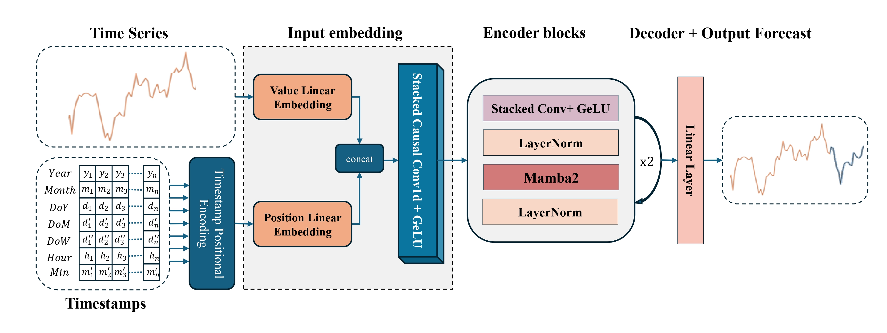

# Mamba4Cast: Efficient Zero-Shot Time Series Forecasting with State Space Models

This repository contains the code for **Mamba4Cast**, a zero-shot foundational model for time series forecasting built on the Mamba architecture. Mamba4Cast predicts the entire forecast horizon in a single pass, offering efficient and scalable forecasting for real-life datasets without the need for task-specific fine-tuning. This work is based on the [Mamba architecture](https://github.com/state-spaces/mamba).

## Project Overview

Mamba4Cast introduces a novel approach to time series forecasting by leveraging synthetic data for training. Built on the Mamba architecture, this model generalizes effectively across diverse time series tasks. Unlike autoregressive models, which predict one step at a time, Mamba4Cast makes a single prediction for the entire forecast horizon, significantly improving computational efficiency.

## Key Features

- **Zero-Shot Forecasting**: Mamba4Cast provides accurate time series predictions without task-specific fine-tuning.
- **Mamba Architecture**: Built on a robust state space model foundation, designed for efficiency and scalability.
- **Synthetic Data Training**: Trained entirely on synthetic data, allowing broad generalization across multiple datasets.
- **One-Pass Forecasting**: Predicts the entire forecast horizon in a single pass, contrasting autoregressive models that predict one step at a time.
- **High Efficiency**: Superior computational efficiency compared to traditional time series models.
- **Near State-of-the-Art Performance**: Competitively benchmarked against leading foundational models on real-world datasets.

## Installation

To install the necessary dependencies and set up the environment for Mamba4Cast, follow the steps below:

1. Clone the repository:
    ```bash
    git clone https://anonymous.4open.science/r/mamba4cast
    cd Mamba4Cast
    ```

2. Create a virtual environment (optional but recommended) with python `3.10.13`

3. Activate the environment and run the following bash script:
    `bash install_requirements.sh`

4. Create a directory `models` in the main directory of the project, download our [model weights](https://www.dropbox.com/scl/fi/s7l0razs4xdctcbxkik5t/mamba4cast_2l_1024_conv_i5e5.pth?rlkey=khd27b5tw4ipp06pt13vgl1l5&st=a3bfak3v&dl=0), and place the file in `models`.

Other requirements:

- Linux
- NVIDIA GPU
- CUDA 11.8+

## Example usage

You can refer to the [Mamba4Cast_example.ipynb](Mamba4Cast_example.ipynb) notebook to have results resembling the sine-wave figure in the paper.
